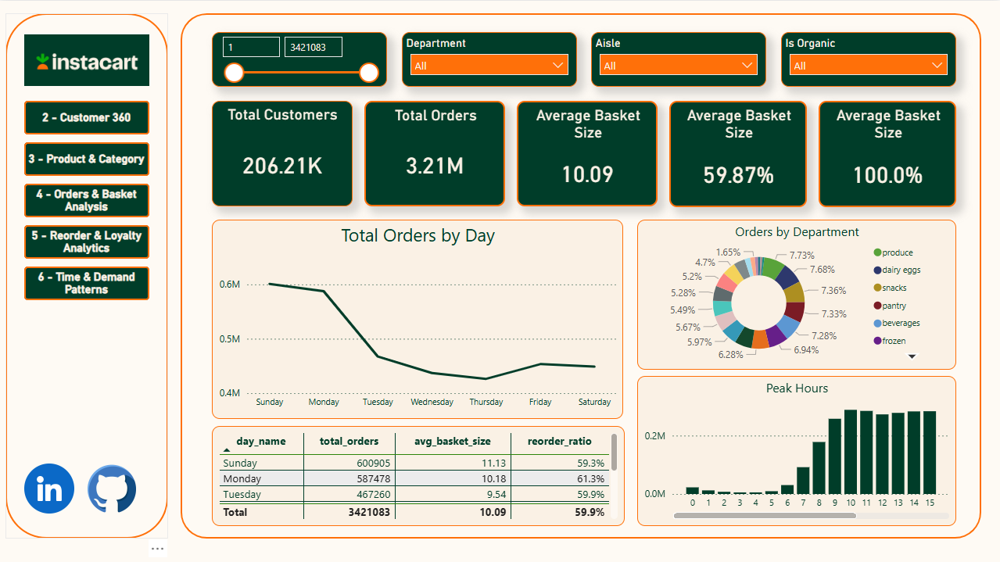

# Instacart Order Analytics — End-to-End BI & Advanced Analytics Project

## 📌 Project Overview

This project is a full end-to-end Business Intelligence and Analytics solution built on the Instacart public dataset.  
It demonstrates the complete lifecycle of a BI project:

- Data modeling and dimensional design (star schema)
- SQL-based ETL and metric engineering
- Advanced KPI definition
- Power BI dashboarding and storytelling

The final deliverable is a **multi-page interactive Power BI report** designed for different stakeholder needs, ranging from executives to analysts.

---

## 🎯 Business Objectives

The project aims to answer key business questions such as:

- How do customers behave over time?
- Which products and categories drive loyalty and reorders?
- How do basket size and order frequency evolve?
- What time patterns influence demand?
- Can customers be segmented objectively based on behavior?
- Which products are statistical outliers in reorder behavior?

---

## 🏗️ Data Architecture

### Data Model
The solution uses a **star schema** optimized for analytics and Power BI performance.

#### Fact Tables
- `fact_order_details` — item-level transactional data
- `fact_order_summary` — order-level aggregated metrics

#### Dimension Tables
- `dim_customer`
- `dim_product`
- `dim_department`
- `dim_aisle`
- `dim_date`
- `dim_time`

The model enforces:
- Surrogate keys
- One-to-many relationships
- Clear separation of facts vs dimensions

---

## 🔄 Data Processing & ETL

All transformations and aggregations were performed using **SQL Server**:

- Raw Instacart data cleaned and standardized
- Dimensional tables created and populated
- Fact tables loaded using deterministic, repeatable logic
- No calculated columns added in Power BI (model kept clean)

SQL was used for:
- KPI base calculations
- Customer metrics
- Order and basket statistics
- Reorder logic

---

## 📊 Power BI Report Structure

The Power BI report is organized into **six analytical pages**, each with a clear purpose.

### Page 1 — Executive Overview
High-level KPIs and trends:
- Total Orders
- Total Products Sold
- Reorder Rate
- Average Basket Size
- Time and demand overview

**Audience:** Executives, leadership

---

### Page 2 — Customer 360 (Drillthrough)
Customer-level insights:
- Order frequency
- Basket behavior
- Reorder tendencies
- Temporal patterns per customer

**Audience:** CRM, retention teams

---

### Page 3 — Product & Category Insights
Product performance analysis:
- Top products and departments
- Reorder leaders
- Product contribution to baskets
- Category demand patterns

**Audience:** Merchandising, category managers

---

### Page 4 — Orders & Basket Analysis
Order composition analysis:
- Basket size distribution
- Items per order
- Add-to-cart behavior
- Order structure trends

**Audience:** Operations, growth teams

---

### Page 5 — Reorder & Loyalty Analytics
Customer loyalty indicators:
- Reorder ratios
- Repeat purchase behavior
- Loyal vs casual customer patterns

**Audience:** Retention, marketing

---

### Page 6 — Time & Demand Patterns
Temporal analysis:
- Day-of-week demand
- Hour-of-day trends
- Peak vs off-peak behavior
- Time-driven demand insights

**Audience:** Supply chain, operations

---

## 🛠️ Tools & Technologies

- **SQL Server** — data modeling & ETL
- **Power BI** — visualization & storytelling
- **GitHub** — version control & documentation

